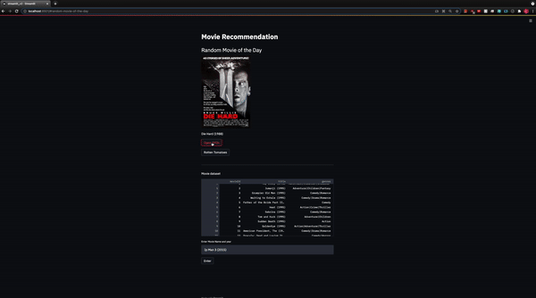

# MovieLens Recomendation

**Authors**: Tony Bai, Eddie Lin, Douglas Lu, Shane Mangold

## Overview



Our team was tasked to build and explore a recommendation system based on the MovieLens dataset. In this project, we explored both Content-Based and Collaborative Recommendation systems built on 100,000 user movie ratings.

Most internet products we use today are powered by recommendation systems. YouTube, Netflix, Amazon, Pinterest, and a long list of other internet products and services all rely on recommendation systems to filter through millions of contents in order to make personalized recommendations to their users. Recommendation systems are well-studied and have been proven to provide tremendous values to internet businesses and their consumers.

There are mainly six types of recommendation systems which work primarily in the Media and Entertainment industry:

* Collaborative recommender system
* Content-based recommender system
* Knowledge-based recommender system
* Hybrid recommender system
* Demographic-based recommender system
* Utility-based recommender system

## Business Problem

Nowadays, every recommended movie that consumers can find across their platform, whether its Hulu, Netflix or Prime Video, are all limited only to those movies that are contained in each application. We aim to build a third party movie recommender that can take a title and recommend you similar movies that are not limited to a streaming platform

Our team has been tasked to build a recommendation system model in order to improve upon existing recommendation systems. We will explore the traditional recommendation systems and attempt to build a hybrid model that will utilize multiple recommendation systems in order to provide improved reccomendations.

## Data

For this project, we will be utilizing the classic MovieLens 100K dataset. MovieLens is a rating dataset from the MovieLens website, which has been collected over several decades. The dataset was released back in April of 1998 and is a stable benchmark dataset, with 100,000 ratings from 1000 users on 1700 movies. 

A little more information about the dataset:

MovieLens data sets were collected by the GroupLens Research Project at the University of Minnesota.

This data set consists of:

* 100,000 ratings (1-5) from 943 users on 1682 movies.
* Each user has rated at least 20 movies.

## Methods

### Content Based Filtering

We first explored content based filtering using TF-IDF vectorizer to calcualte the distance between the data points. We chose to use cosine similarity to measure the distance between these vectors. Cosine similarity is a measure of similarity between two non-zero vectors of an inner product space that measures the cosine of the angle between them. Given two vectors of attributes, A and B, the cosine similarity, cos(θ), is represented using a dot product and magnitude as Inline-style. From the TF-IDF vectorizer we would then return a list of movies that exhibit the most cosine similarity.

### Collaborative Filtering

Item-Item:

Item-item collaborative filtering, or item-based, or item-to-item, is a form of collaborative filtering for recommendation systems based on the similarity between items calculated using people's ratings of those items. In this instance, we are trying to find movies that are similar to each other based on people's ratings of those items (in this case, movies). This algorithm takes far less resources and time than user-user due to its fixed number of movies and also to the fact that we do not require a similarity score between all users. 

We used item-to-item filtering to constuct a function where we created a similarity matrix of top rated movies of the selected user. From there we obtain the pairwise distance between the selected movie and all other movies. The function then returns a unique list of movies that are most similar (closest pairwise distance from those movies) as the recommendation. 


## Results

Evaluating a recommendation system can be very tricky because there are so many different metrics to look at. For instance, academic metrics for evaluating models are typically RMSE, MAE , Recall and accuracy etc.  However a high error for a model does not necessarily correspond directly to a poor recommendation system. For the purpose of a recommendation system we would recommend to evaluate also on "online" metrics such as A/B testing various versions of the recommendation system

The RMSE is aroun .87 and our MAE is around .67 for our Knn and SVD models which is pretty decent. We chose to look closely at mean squared error since it tells us how far off our predicted score is versus the actual scores that the user chose. This score doesnt reflect the actual performance of our recommendation system due to the fact that we are using collaborative filtering. We would like to refine our model and reduce the error because our hybrid model utilizes collaborative filtering and modeling.

Another metric we decided to look at is coverage: what percentage of movies does our system recommend from the total pool. Our user to user covers 11% and 32% for our item to item. This is not great. Due to the skewedness of the genres and how our item to item model uses genre to recommend, many genres movies do not get selected. We will aim to improve this by allowing users more options in selecting movies they want and adjusting the intertface to allow the user to further filter the output. For example movies that are more recent or during a certain timeframe or another example would be allowing the user to select a minimum number of reviews before a movie is recocmended.

## Conclusions

These algorithms provided a baseline knowledge of how a sophisitcated combined filter can be accomplished. Next steps would be combining the models together in a web implementation that has a more sophisticated user interface.

## For More Information

Please review our full analysis in [our Jupyter Notebook](./dsc-phase1-project-template.ipynb) or our [presentation](./DS_Project_Presentation.pdf).

For any additional questions, please contact **name & email, name & email**

## Repository Structure

Describe the structure of your repository and its contents, for example:

```
├── README.md                           <- The top-level README for reviewers of this project
├── main.ipynb   <- Narrative documentation of analysis in Jupyter notebook
├── Project_Presentation.pdf         <- PDF version of project presentation
├── Data
│   ├── Archive                     <- old notebooks
├── data                                <- Both sourced externally and generated from code
└── images                              <- Both sourced externally and generated from code
```
